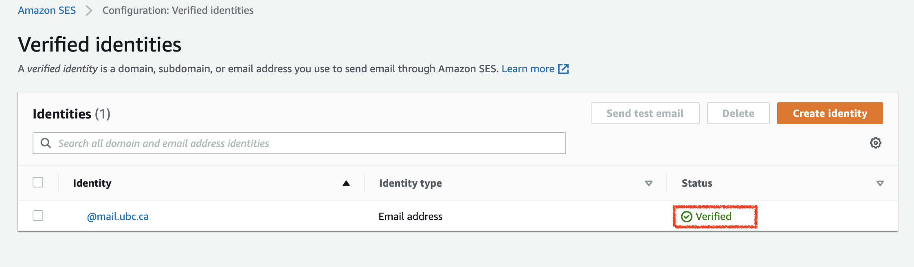
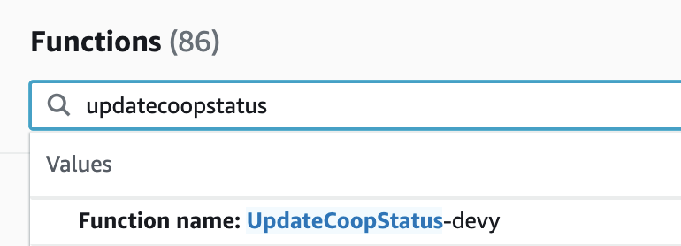
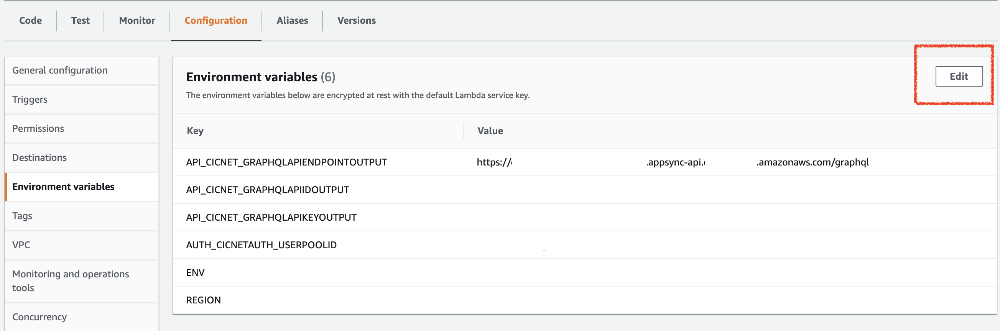

# Deployment Guide

This project was bootstrapped with Create React App.

## Installation

Follow these instructions to deploy the frontend:

1 - Use the provided 1-click deployment button below.

2 - Select **Connect to GitHub**, and then you will be asked to connect to your GitHub account. Amplify Console will fork this repository into your GitHub account before deploying.

3 - Select your AWS service role in the dropdown. If you don't have one configured, Select 'Create new role' and quickly create one using the default settings.

4 - Click Save and Deploy, and wait for deployment to complete in the Amplify console. This may take some time to complete.

## Email Notifications Set Up
In this step, you will set up the source email that is needed to send out email notifications, for e.g. when the user's user type is confirmed by an admin/staff.

1 - In the AWS Management Console, open up [AWS Simple Email Service](https://aws.amazon.com/ses/) (AWS SES). 

2 - On the side bar, under **Configuration**, click on **Verified Identities**.

3 - Click on **Create Identity** button. This will bring you to the *Create Identity* form page.

4 - Under **Identity type**, select **Email address** and enter the email that you will use to send out emails to other users/receivers. 

Then click on **Create Identity**. The inbox of the email which you have entered will receive a link that you have to click into and verify your identity. 

5 - If successfully, when you refresh the *Verified Identities* page, the status of the email will change to Verified. 

## Environment Variable Set Up in Lambda

1 - In the AWS Management Console, open up the Lambda Services Console. Search *updatecoopstatus* and select the function with the same name in it.

2 - Under the **Configuration** tab, click on **Environment variables** and then click on **Edit**.

3 - Click on **Add environment variable**:
- for the key, SOURCE_EMAIL; 
- for the value, enter the email that you verified under the SES Console in earlier steps.

4 - Click on **Save**.

5 - Now your `UpdateCoopStatus` function should work properly and it will update the user's user type whom's coop term end. 
