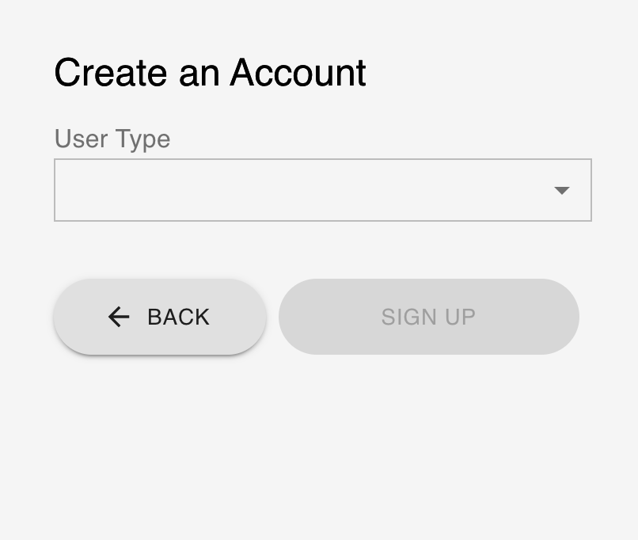
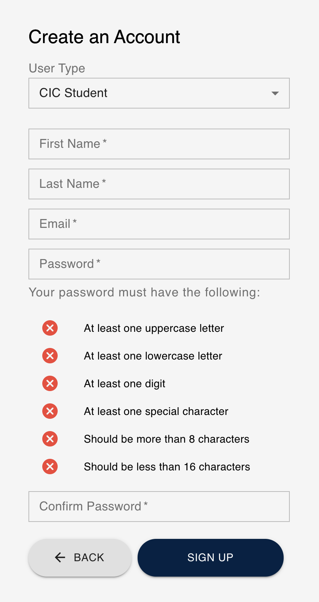
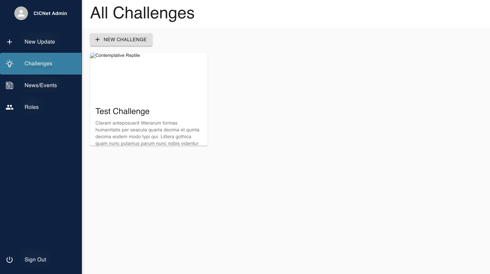
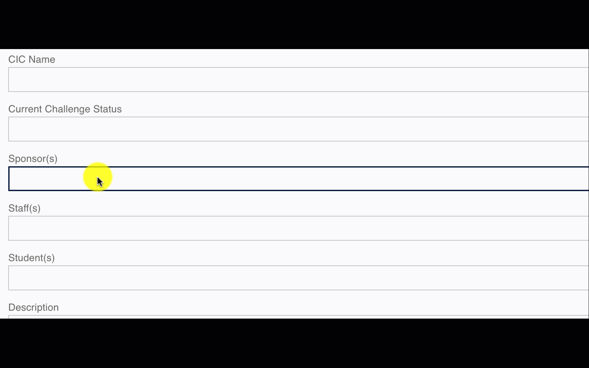
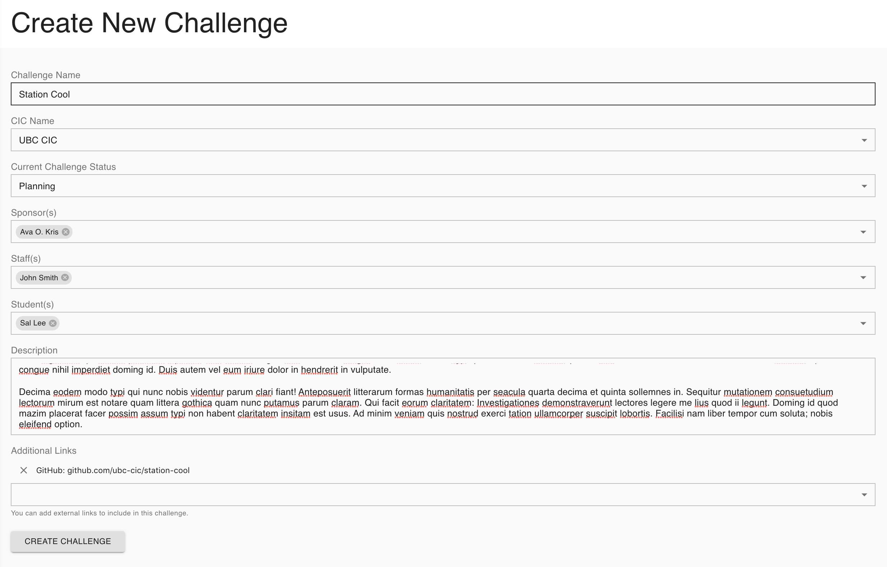
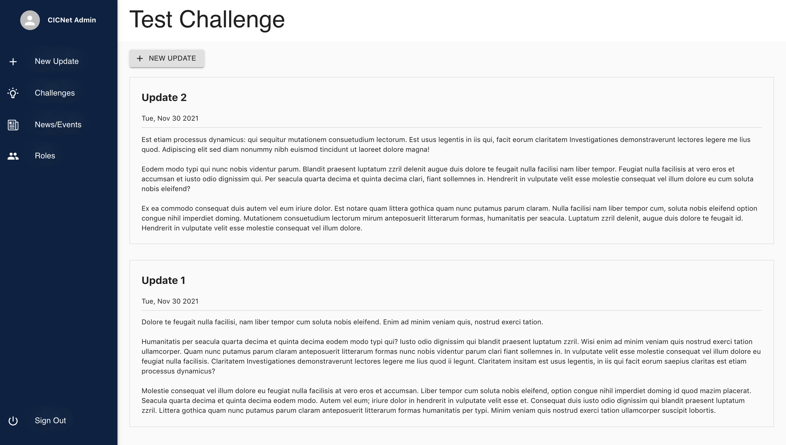
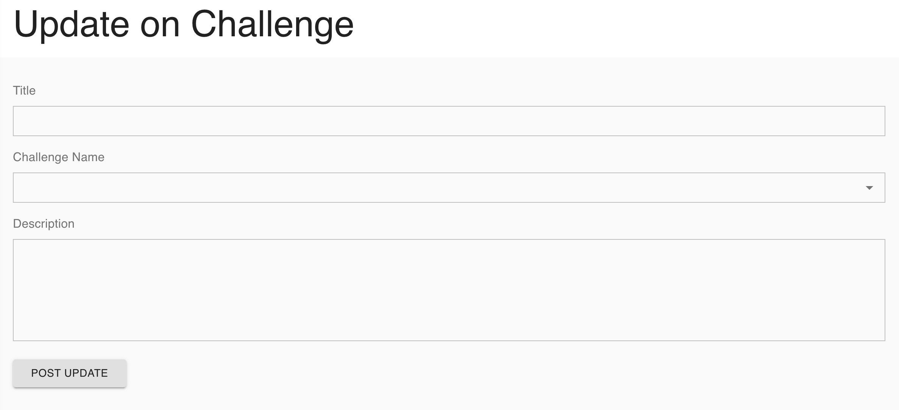
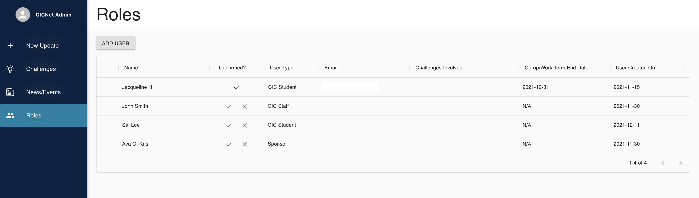
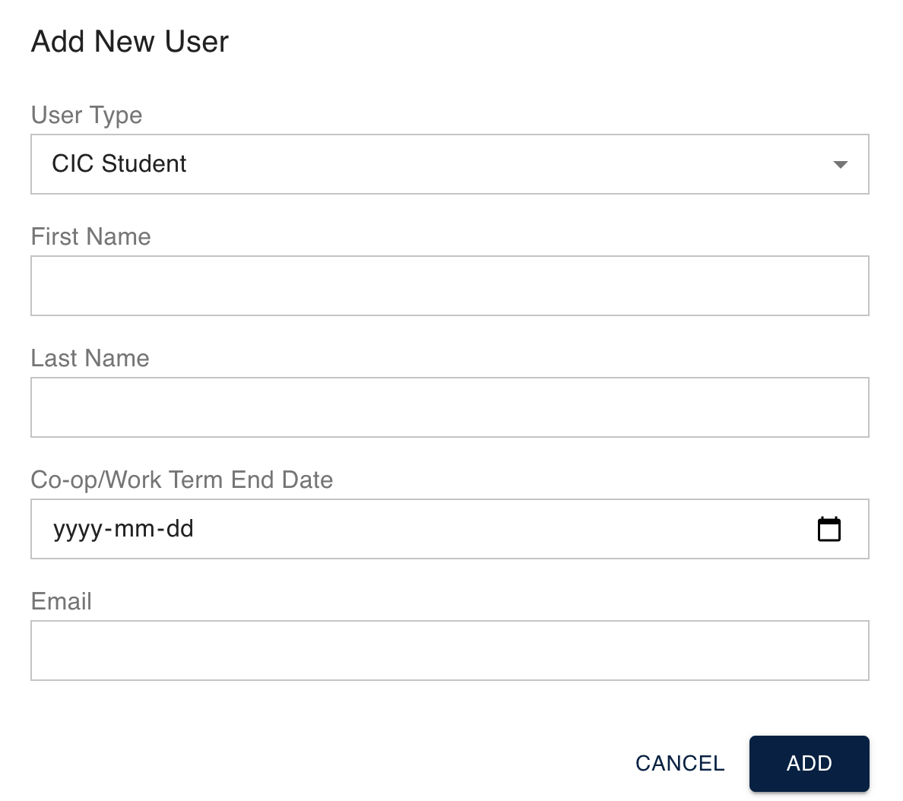

# CICNET User's Guide
This user guide contains a brief tutorial to get you started using CICNET

---

## Logging In and Account Creation

1 - When first opening the application, you will be greeted with the login screen.

2.1 - If you have not yet created an account, please click **CREATE AN ACCOUNT**. You will be asked to select a user type. There are four types: Alumni, CIC Student, CIC Staff, and Sponsor. Choose the one that describe your role.

2.2 - Enter your user information and click **SIGN UP**.

2.3 - Enter the confirmation code that you receive in your email.

3 - If you have an account, enter your email and password to sign in.

## Views after Login

In the current phase, there are 4 main views that the admin user can have access to: 

1. [Challenges](#)
2. [New Update](#)
3. [News/Events](#)
4. [Roles](#)

The user can access these through the tab bar on the left side of the screen.

## 1. Challenges

The admin user will automatically be redirected to the Challenges page after the login. 

### 1.1) All Challenges Page
In this page, it shows all the challenges that have been created, either by the admin or the CIC Staff.

Each challenge component shows the name of the challenge, the description, and a picture of the challenge.

### 1.2) Create a Challenge Component

1.2.1) Click on the **NEW CHALLENGE** button. 

1.2.2) You will be directed to the following page to fill out a form.

- Challenge Name: the name of the new challenge
- CIC Name: Select the CIC that is responsible for this challenge
- Current Challenge Status: Specify the status of the new challenge, planning/developing/completed
- Sponsor/Staff/Student(s): enter the names of the people that are involved in the challenge. If the name you are looking for is not shown in the list, you can add one by entering the name in the text field. Then from the drop down, click on the newly entered name. A form will pop out. You can fill out the email now, but you don't have to. This information is editable later under Roles.

    

- Description: add a description for the challenge
- Addition Links: add links that are related to this challenge

1.2.3) Once done filling out the form, click on **CREATE CHALLENGE**. A filled-in form can look like this.

### 1.3) Individual Challenges Page
To see updates of an individual challenge, click into one of the challenge component. It will show updates in the order of the latest updates to the oldest updates.

### 1.4) Create a New Update 
If you want to create a new update for this challenge, click on the NEW UPDATE button and you will be directed to the New Update page. If you add an update through this method, the Challenge Name in the new update form will be filled in for you. More details in the New Update section.

## 2. New Update
To post an update for a challenge, you can either click on New Update from the left side bar, or the button inside a challenge page (see step 1.3 and 1.4).

2.1) Fill in the title, challenge name and description. 
2.2) Then click on **POST UPDATE** and you will be able to see the newly created post inside the challenge that you've selected.

## 3. News/ Events
This page is still in progress.  

In this page, you will be able to see and post news and events that are happening around the CIC or specifically for the CIC Projects. Users will be able to subscribe to news and events as well, which they will be able to subscribe and receive emails notifications.

## 4. Roles
Admin users and CIC Staffs can use this page to view, confirm, add, and edit users to allow them to have different access to the CICNET Site.

### 4.1) View User List
There are 8 columns on the chart in the Roles page. Each row contains the information for an user. Below are explanations of each column from left to right

- Edit column: when you hover over each row, a pen icon will appear indicating that you can edit this user's information.
- Name: name of user
- Confirmed?: this is a boolean entry indicating whether or not the admin/ CIC staff has confirmed this user's user type which they have chosen when they register for an account. Confirming the user type will give them the corresponding access to the CICNET Site. For example, if the user indicate that they are a CIC Staff, and the admin confirms, this user would have access to the roles page; if the admin declines, the user would only have general access to the site.
- User Type: the user type of the user. There are 5 types of users: Alumni, Sponsor, CIC Student, CIC Staff, and Admin
    - Alumni: an alumni is a previous CIC Student but their co-op term has ended. They can only view challenges, posts, and news/events.
    - Sponsor: sponsor of the challenge project. They can view and post updates that they sponsored.
    - CIC Student: a student of the CIC that work on the challenge project(s). They can view and post updates that they are currently working on or previously worked on. On the day after their Co-op/Work Term End Date, they will be automatically changed to the Alumni User Type.
    - CIC Staff: Have full access to the site, but cannot delete CIC Staff users (?).
    - Admin: Have full access to the site, are able to delete all users.
- Challenges Involved: the name of the challenges that this user is involved in
- Co-op/Work Term End Date: the user's end date of the co-op term or work on. On the day after this date, their user type will be changed to Alumni through a scheduled lamdba function and an email will be sent to this user to notify the change.
- User Created On: the date that the user is created/ registered

### 4.2) Add User
Admins and CIC Staffs can add a user by clicking on the **ADD USER** button on the top of the roles chart. According to different types of user, they will have different information to fill out. Once they press the **ADD** button, this newly created user will show up in the roles chart. 
TBD task: If the email is filled, an email will be sent out to this user to notify them that they are added as a user and invited to register for an account.

### 4.3) Edit User
Admins and CIC Staffs can edit the user by clicking on the pen icon on the left side of the chart.
