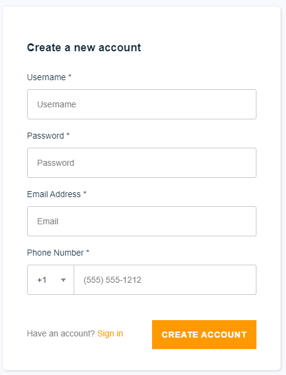
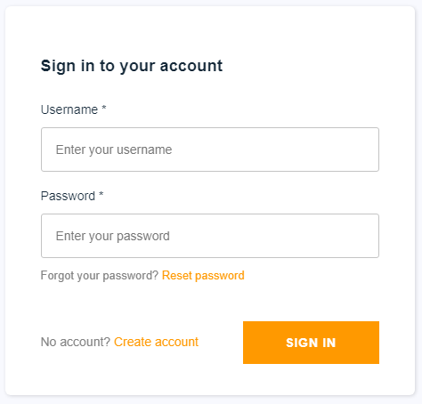
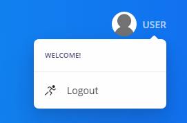
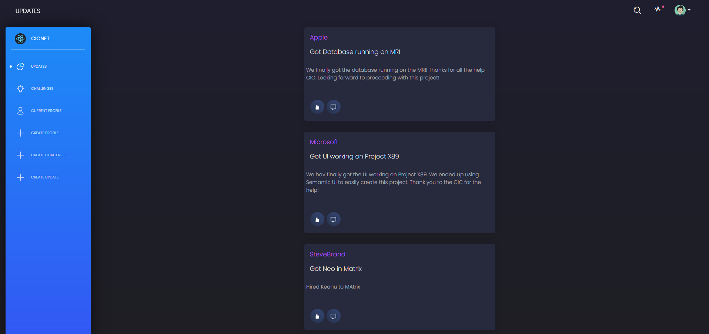
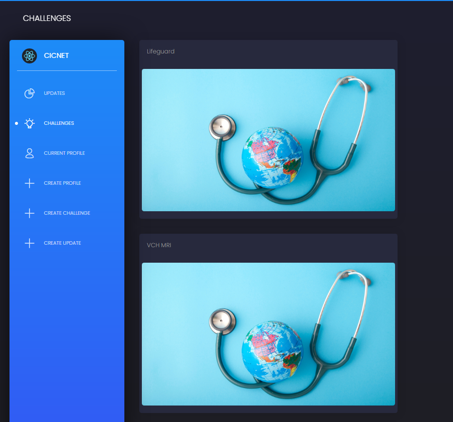
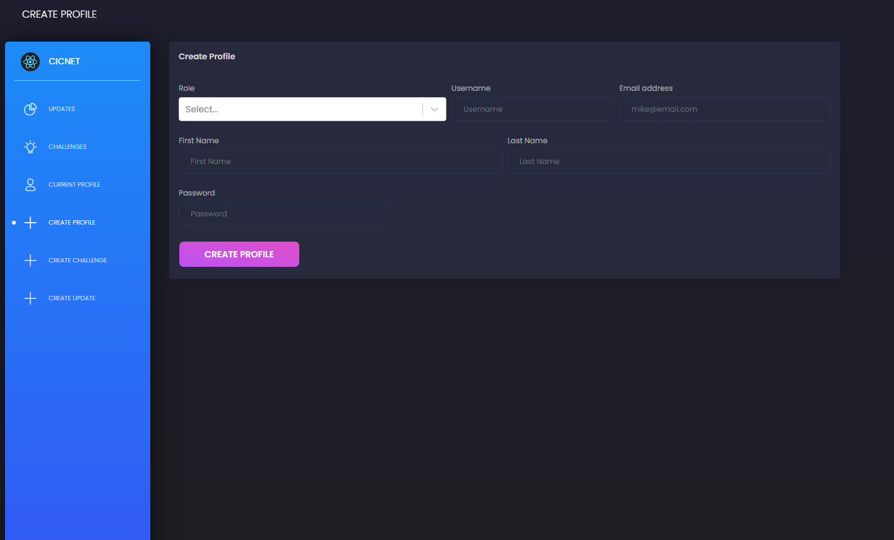
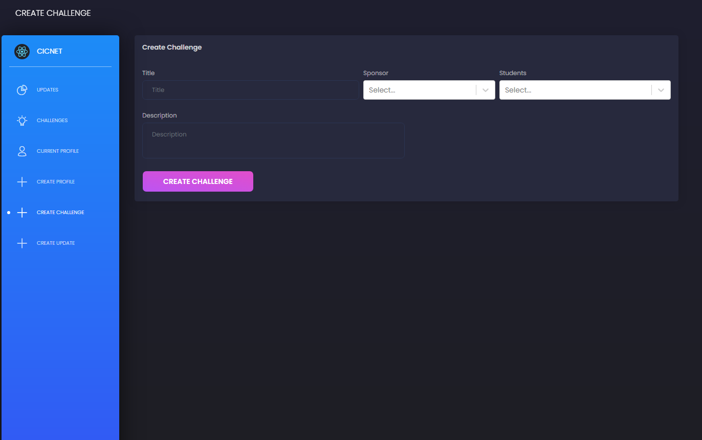
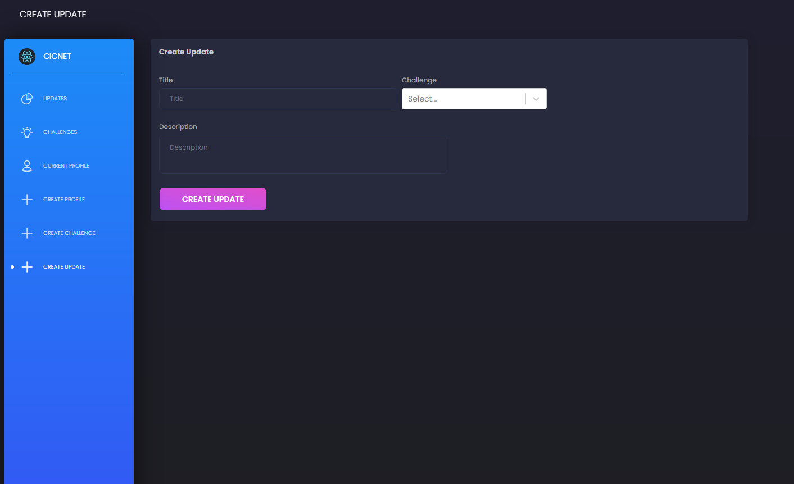

# CICNET User's Guide
This user guide contains a brief tutorial to get you started using CICNET

---

## Logging In and Account Creation

1. When first opening the application, you will be greeted with the login screen powered by Amazon Cognito. Please click **Create account** if you have not yet created one.

2. If you have an account, you will be greeted by the sign in screen. Enter your credentials to continue.

2. To sign out of your account, click on the Logout Button found on dropdown on the 

## Update Page

To view the updates from every sponsor, go to the **UPDATES** page
Each card represents a single update. On the card is the Sponsor name( which links to the Sponsor page), update title, and a short description.

## Challenge Page
To view the current active challenges at the CIC, go to the **CHALLENGES** page. Each card represents a challenge. In the future, it will link to the challenge on the CIC website. There will also be a follow button to follow that particular challenge.

## Create Profile Page
To create a profile for alumni or Sponsors, CIC staff will use this page. Input the details such as the Username and email, and select the Role from dropdown. After, click on the **CREATE PROFILE** button. This will create a profile in AWS Cognito, make an item in the USER table on DynamoDB. An email will be sent with the verification code, and then the user can log into their account.

## Create Challenge Page
To create a challenge, CIC Staff will use this page. The title and description are input in the text fields, then the students and sponsors are selected from the respective dropdown fields. After, click on the **CREATE CHALLENGE** button. A challenge will be created in the database.

## Crate Update Page
To create an update, CIC Staff will use this page. The title and description are input in the text fields, then the challenge is selected from the dropdown field. After, click on the **CREATE UPDATE** button. An update will be created in the database.

## NEXT STEPS

1. Implement method for only displaying create profile and create challenge options for CIC staff accounts. 
2. Implement notifications when specific sponsors create updates.
3. Implement follow button on sponsor profile (backend completed, need UI support)

